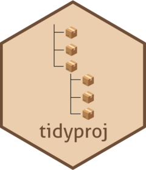

<!-- README.md is generated from README.Rmd. Please edit that file -->

# tidyproj 

<!-- badges: start -->

[](https://lifecycle.r-lib.org/articles/stages.html#stable)
[](https://github.com/almeidasilvaf/tidyproj/actions)
[](https://app.codecov.io/gh/almeidasilvaf/tidyproj?branch=master)
<!-- badges: end -->

The goal of `tidyproj` is to create a standard directory structure for
scientific projects, including a code, data, and products directory.
This way, all projects will look the same, making it easier to load and
save data in different projects.

You can see an example directory created with `tidyproj` in
inst/extdata. The directory structure looks like this:

``` r
exampledir <- system.file("extdata", "exampledir", package = "tidyproj")
fs::dir_tree(exampledir)
#> /home/faalm/R/x86_64-pc-linux-gnu-library/4.2/tidyproj/extdata/exampledir
#> ├── code
#> │   ├── 01_first_analysis.Rmd
#> │   ├── 02_second_analysis.Rmd
#> │   ├── 03_third_analysis.Rmd
#> │   └── 04_fourth_analysis.Rmd
#> ├── data
#> │   └── DATA_DESCRIPTION.Rmd
#> └── products
#>     ├── figs
#>     ├── plots
#>     ├── result_files
#>     └── tables
```

## Installation

You can install the development version from
[GitHub](https://github.com/) with:

``` r
# install.packages("remotes")
remotes::install_github("almeidasilvaf/tidyproj")
```
